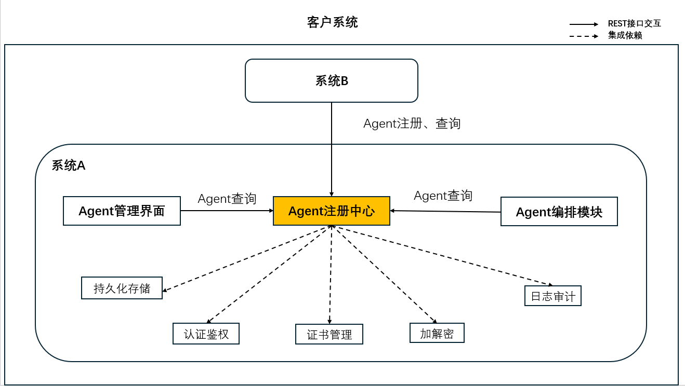

# 1 产品介绍

# 2 软件安装指南（快速安装）

# 3 快速入门

注册中心是一个专注于Agent统一管理的服务，支持用户将来自不同厂商的Agent进行集中注册与管理，实现多源Agent的可控接入与维护。主要功能包括：

- **注册AgentCard**：支持将不同厂商的Agent注册到中心，统一纳管。
- **查询AgentCard列表**：根据指定条件查询符合条件的AgentCard列表。
- **查询指定AgentCard**：按AgentCard名称和组织精确查找唯一的AgentCard实例。
- **更新指定AgentCard**：更新指定AgentCard的信息。
- **删除指定AgentCard**：删除不再使用的AgentCard。
- **按语义检索AgentCard**：根据自然语言语义检索相匹配的AgentCard。

通过这些功能，注册中心可以帮助用户高效整合、维护与发现各类 Agent，为上层编排与协同提供基础能力。

编排中心是一个面向多智能体（Agent）协作的可视化编排平台，支持通过图形化工作流设计器定义 Agent 之间的调用关系与执行流程。后端基于 Python 框架解析流程并驱动 Agent 协同工作，帮助用户高效构建、管理和运行复杂的 Agent 协作流程。主要功能包括：

- **PSOP 管理**：支持工作流（PSOP）的列表查看、详情查询、保存与删除操作。
- **PDF 解析**：提供 PDF 文件内容解析能力，为后续流程设计提供数据支持。
- **智能规划**：根据用户需求自动生成工作流规划，降低编排门槛。
- **Agent 管理**：获取全量 AgentCard 列表，便于了解可用能力与调用方式。
- **自然语言生成 PSOP**：通过自然语言意图直接生成可执行的编排流程。
- **意图检索 PSOP**：根据自然语言描述，检索匹配的历史工作流。
- **实时流程执行**：支持以流式方式启动 PSOP 执行，并实时推送运行进展，便于监控与调试。
## 3.1 环境准备

在开始之前，请确保您的开发环境满足以下要求：

| 依赖项 | 版本要求     | 用途 |
| --- |----------| --- |
| Node.js | &gt;= 20.19 | 编排中心前端 |
| Python | &gt;= 3.10 | 注册中心与编排中心后端 |

## 3.2 启动服务
### 3.2.1 启动注册中心服务
启动方式见注册中心的用户指南或Readme文档
### 3.2.2 启动编排中心后端服务
启动方式见编排中心的用户指南或Readme文档
### 3.2.3 启动编排中心前端界面
启动方式见编排中心的用户指南或Readme文档
## 3.3 启动示例 Agent
为了快速体验完整流程，可以启动项目自带的示例 Agent 服务
```bash
cd {项目路径}/orchestration-center/samples
python start_agents_server.py
```
该脚本会：

- 向注册中心注册多个示例 Agent
- 启动对应的 Agent 服务，供编排中心调用
## 3.4 核心流程验证
完成上述步骤后，您可以按照以下流程体验 OpenAN 的核心能力：


### 3.4.1 访问编排中心界面

打开浏览器访问 `http://localhost:3003`

### 3.4.2 配置服务地址

点击界面右上角的齿轮图标，将后端 IP 和端口修改为编排中心后端的实际地址，保存。

### 3.4.3 查看 Agent 库

左侧展示从注册中心获取的所有 Agent，可通过名称或功能进行搜索。

### 3.4.4 创建工作流
点击 `+` 按钮，选择创建方式：

| 方式 | 操作说明 |
| --- | --- |
| PDF 导入 | 上传 PDF 文件，系统自动解析并生成 PSOP |
| 手动编排 | 将 Agent 卡片拖拽到画布，通过连线定义执行顺序 |
| 自然语言生成 | 输入业务意图描述，后台自动编排生成 PSOP |
- (具体创建流程见编排中心用户指南)
### 3.4.5 执行工作流
- 输入用户意图，点击“检索工作流”按钮
- 选择匹配的 PSOP
- 点击 `▶` 按钮执行，右侧区域实时显示执行过程
